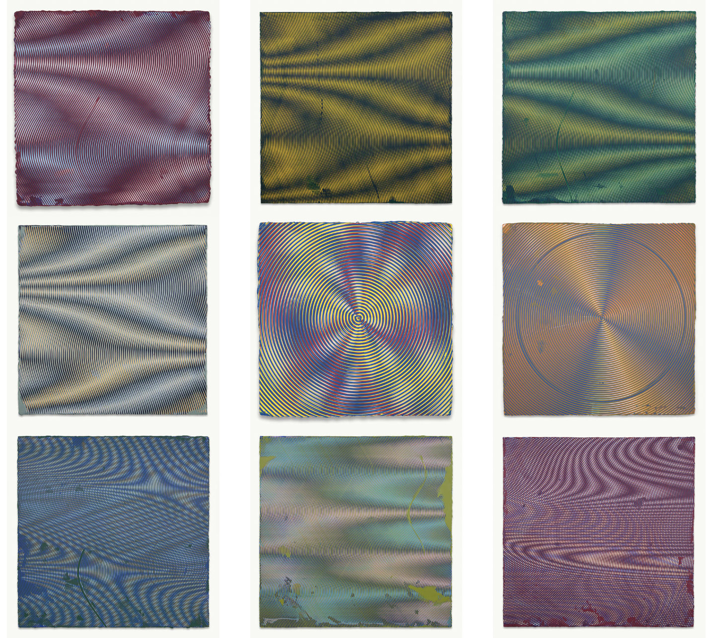
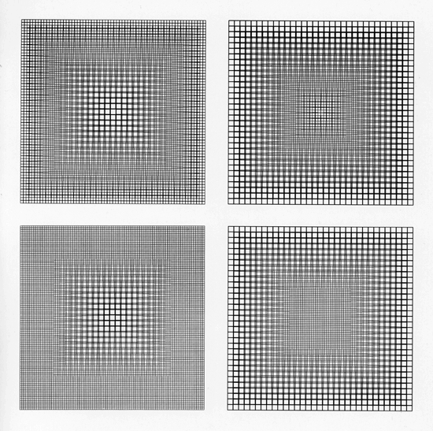
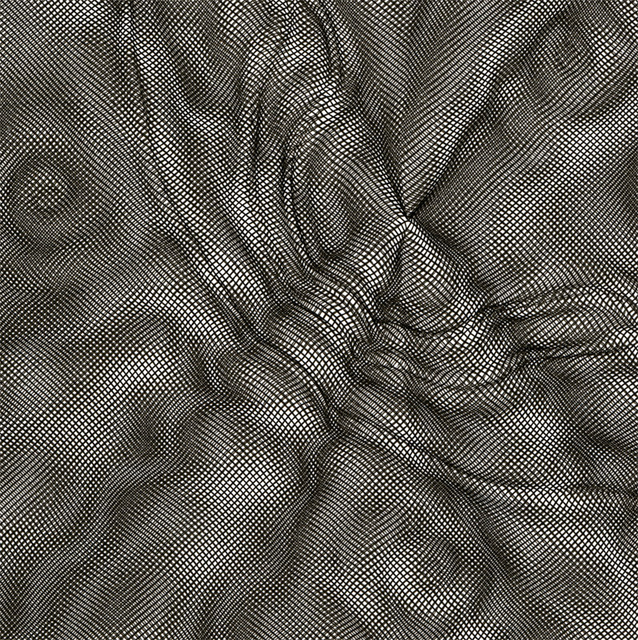
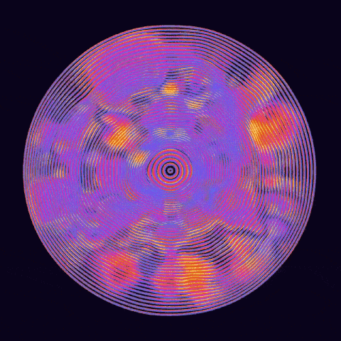
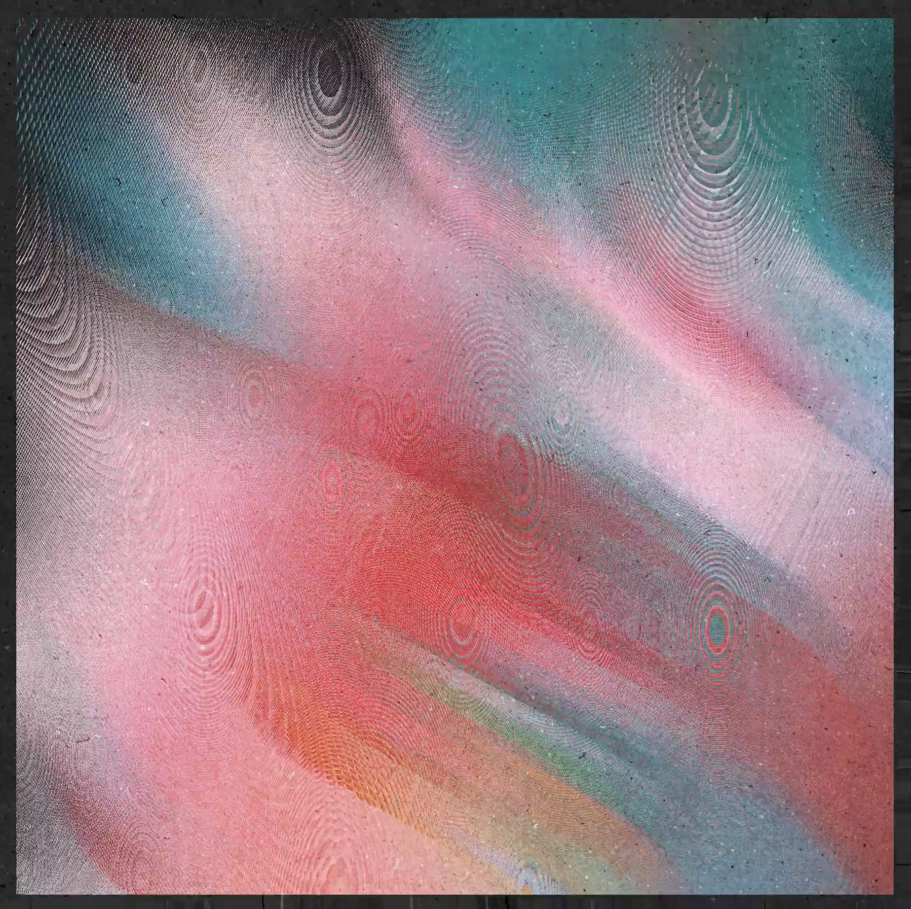
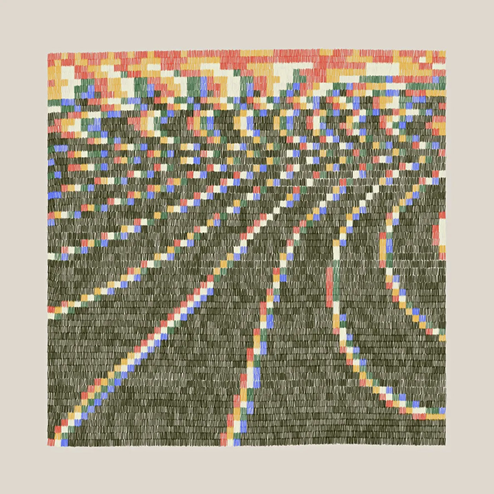
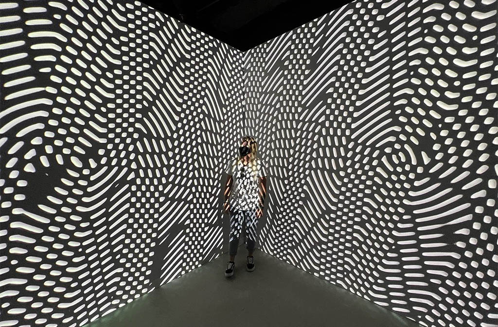

# Moiré Pattern Unit for *Creative Coding*

Golan Levin 
Professor of Computational Art 
CMU School of Art

---

### Assignment

Using iteration, generate a set of parallel lines or curves, spaced at narrow intervals. Onto this, overlap another set of lines, differing by a small rotation and/or translation, to create a subtle [Moiré pattern](https://en.wikipedia.org/wiki/Moir%C3%A9_pattern). To achieve the rotation, I recommend that you use the p5.js `rotate()` function. (Here's a [Coding Train tutorial on rotation](https://www.youtube.com/watch?v=o9sgjuh-CBM), if it's helpful, and a [tutorial about rotate() by Xin Xin](https://www.youtube.com/watch?v=maTfm84mLbo).)

Present your composition in a fullscreen canvas (use `createCanvas(windowWidth, windowHeight);` or the [fullscreen()](https://p5js.org/reference/#/p5/fullscreen) command). You may use whichever colors you prefer. 

To fine-tune your composition, I recommend you place some dimensions of variability (such as the line separation, line weight, position, and/or rotation angle) under interactive control. Feel free to retain this interactivity, or to remove this interactivity altogether you feel ready to commit to specific values for these variables.

It's possible to make some very sophisticated and mind-bending displays using the Moiré effect. Check out this video, for example around 2'35":

<iframe width="100%" height="250" src="https://www.youtube.com/embed/4nn1MqCMa1M?si=5U9Rx9MLuz9EZECQ" title="YouTube video player" frameborder="0" allow="accelerometer; autoplay; clipboard-write; encrypted-media; gyroscope; picture-in-picture; web-share" allowfullscreen></iframe>

---

### References

Prof. Anoka Faruqee, on the painting faculty at Yale, creates paintings that make use of Moiré-type interference patterns. 

<iframe width="100%" height="315" src="https://www.youtube.com/embed/hYn3Ou8L3o0?si=aCmtZIFxDYY16hcJ" title="YouTube video player" frameborder="0" allow="accelerometer; autoplay; clipboard-write; encrypted-media; gyroscope; picture-in-picture; web-share" allowfullscreen></iframe>

This early minimalist quartet of computer plotter drawings by Manfred Mohr — "P-137, Graph Pattern" (1973) — obtains intensity from Moiré-type interference:

[Jean-Pierre Hébert](https://www.artsy.net/artist/jean-pierre-hebert) was an early algorist who used computer-controlled plotters to create nuanced interference patterns. This is from c.1990:

Kath O'Donnell develops Moiré interference patterns [from the trails left by the edges of rotating 3D forms](https://www.fxhash.xyz/generative/20956). 

Liam Egan creates [interactive Moiré patterns](https://www.fxhash.xyz/generative/slug/euphonic) with stunning colors:

Amy Goodchild's lavalike [*No Apologies*](https://foundation.app/@amygoodchild/foundation/80549) animation is mesmerizing.

 

Melissa Weiderrecht's [*Both Be Both*](https://superrare.com/artwork-v2/both-be-both-41921) (2023) animation explores contrasts: "pixelated and soft, glitchy and smooth, digital and textured".

 

Nat Sarkissian's [*Hello Modulo*](https://verse.works/collections/hello-modulo-by-nat-sarkissian) presents a contrast between machinic interference patterns and a 'hand-drawn' (computational) rendering style.

Cacheflowe (Justin Gitlin)'s [*Moiré-Room*](https://cacheflowe.com/art/physical/moire-room) is an immersive environment at Meow Wolf Denver. 

---

### For Further Research

Some additional Moiré work you might like includes: 

* [Nicolas Sassoon's *PATTERNS*](http://www.nicolassassoon.com/PATTERNS.html)
* [*The Science of Moiré Patterns* (book, 1959) by Gerald Oster with Edmund Scientific](http://www.herocomm.com/Details/MoireStory.htm)
* [*Moirage* (film, 1967) by Stan VanDerBeek](https://www.stanvanderbeekarchive.com/artists/tFzRGnN/stan-vanderbeek/eMfT1t4/stan-vanderbeek-moirage-1967/)
* [Loren Bednar's *Phase* NFT](https://opensea.io/collection/phase-by-loren-bednar) ([*image*](openprocessing_images/bednar_phase_moire.jpg))
* [Plotter drawings by Jakub Antolak](https://twitter.com/jakub_antolak/status/1680915719339352064) ([*image*](openprocessing_images/jakub_antolak_moire.jpg))
* [Plotter drawings by Julien Espagnon](https://twitter.com/Julien_Espagnon/status/1697540035451461656) ([*image*](openprocessing_images/julien_espagnon_moire_plot.jpg))
* [Plotter drawings by Piterpasma](https://twitter.com/piterpasma/status/1697568448727875941) ([*image*](openprocessing_images/piterpasma_moire_plot.jpg))
* [Tutorial for SVG Moiré Patterns in Blender by Maks Surguy](https://www.patreon.com/posts/exploring-moire-61867805)
* [Mario Klingemann's replication of a pretty lattice in the Manchester Airport smoking area (Twitter thread)](https://twitter.com/quasimondo/status/1132276597405495298)
