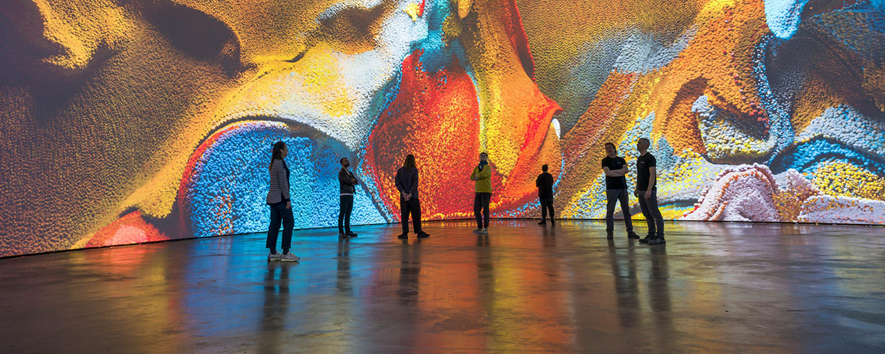

# Some Creative Technology Studios

My *Creative Coding* students asked where and how their skills are used in the world, so I made this informal and very partial list of some creative technology studios — the kinds of places where creative coders work. These organizations lead in fields like interactive installation, information visualization, web design, interactive museum displays, cartography, experience design, audiovisual performance, experimental product design, and interactive entertainment. This list doesn't necessarily include many other types of organizations, such as game companies, computer animation studios, mobile app design studios, corporate R&D labs, academic research labs, graduate schools, or interaction design studios, etc. that also happen to employ creative technologists. Note, the categories below are very loose; many organizations operate in more than one.

People who work at these studios often have *titles* like: Creative Coder, Creative Technologist, Design Technologist, Experience Technologist, New Media Artist, Technical Artist, Computational Designer, Generative Designer, Interaction Designer, UX/UI Designer, Information Designer, Experience Designer (XD), Physical Computing Specialist, Interactive Media Designer, Motion Designer, AV Systems Designer, Software Artist, Interactive Developer, Realtime Developer, Media Systems Engineer, Fabrication Technologist, Interactive Media Producer, Experience Prototyper, Technical Director, Creative Director, Creative Engineer, Design Engineer, Prototyping Engineer, Interactive Engineer.

---

## Experiential / Spatial Media Studios

Design and build interactive physical environments: museums, exhibitions, public installations, architectural media, immersive spaces.

* [Ars Electronica Futurelab](https://ars.electronica.art/futurelab/en/)
* [Art+Com](https://artcom.de/en/)
* [AV&C](https://www.av-controls.com/)
* [Barbarian Group](https://www.wearebarbarian.com/)
* [Cinimod Studio](https://www.cinimodstudio.com/)
* [Cocolab](https://www.cocolab.mx/en/#team)
* [ESI Design](https://esidesign.nbbj.com/work/)
* [FutureForms](https://www.futureforms.us/)
* [iArt](https://iart.ch/en)
* [Jason Bruges Studio](https://www.jasonbruges.com/)
* [Kossman.Dejong](https://kossmanndejong.nl/)
* [Leviathan](https://www.lvthn.com/)
* [Local Projects](https://localprojects.com/)
* [Meow Wolf](https://meowwolf.com/)
* [Moment Factory](https://momentfactory.com/)
* [Newsubstance](https://newsubstance.co.uk)
* [Ralph Appelbaum Associates](https://raai.com/)
* [Random International](https://www.random-international.com/)
* [R/GA](https://www.rga.com/)
* [Rockwell Group](https://www.rockwellgroup.com/lab)
* [Studio Roosegaarde](https://www.studioroosegaarde.net/projects)
* [Superbien](https://www.superbien.studio/)
* [Tangible Interaction](https://www.tangibleinteraction.com/)
* [Tellart](https://www.tellart.com/)
* [Theoriz](https://www.theoriz.com/)
* [United Visual Artists](https://www.uva.co.uk/)
* [WHITEvoid](https://www.whitevoid.com/)

---

## Computational Design & Generative Studios

Use algorithms as primary design material: generative form, parametric systems, simulation-driven aesthetics.

* [Field.io](https://field.io/)
* [Gagarín](https://www.gagarin.is/)
* [Hypersonic.cc](https://www.hypersonic.cc/)
* [Loop.ph](https://loop.ph/)
* [Marpi Studio](https://www.marpi.studio/)
* [Nervous System](https://n-e-r-v-o-u-s.com/)
* [Nonotak](https://www.nonotak.com/)
* [Normal Forms](https://normalforms.io)
* [Onformative](https://onformative.com/)
* [Pan Generator](https://pangenerator.com)
* [Patten Studio](https://www.pattenstudio.com/)
* [SOFT Lab](https://soft-lab.com/)
* [Studio Louter](https://www.studiolouter.nl/)
* [Studio Moniker](https://studiomoniker.com/)
* [SuperUber](https://superuber.com/)
* [Troika](https://troika.uk.com/)
* [Universal Everything](https://www.universaleverything.com/)
* [Variable.io](https://variable.io/)
* [Void.as](https://void.as/)
* [Zeitguised](https://zeitguised.com)

---

## Data, Information, and Editorial Visualization

Transform complex data into narratives, visuals, and interactive explanations, often in public-facing or civic contexts.

* [Accurat](https://studio.accurat.it/)
* [Clever°Franke](https://www.cleverfranke.com/)
* [Dataveyes](https://dataveyes.com/en)
* [Domestic Data Streamers](https://domesticstreamers.com)
* [Fathom](https://fathom.info/)
* [Informationart](https://informationart.com/)
* [InformationIsBeautiful](https://informationisbeautiful.net/)
* [NASA Scientific Visualization Studio](https://www.youtube.com/@nasascientificvisualizatio5842/videos)
* [NYTimes Graphics Lab](https://www.nytimes.com/spotlight/augmented-reality)
* [Observable Studio](https://observablehq.com)
* [Periscopic](https://periscopic.com/#!/company)
* [Pitch Interactive](https://www.pitchinteractive.com/)
* [Polygraph](https://polygraph.cool/)
* [The Pudding](https://pudding.cool)
* [Stamen](https://stamen.com/)
* [Stimulant](https://www.stimulant.com/)
* [Truth & Beauty](https://truth-and-beauty.net/)

---

## Interactive Systems for Culture & Institutions

Build long-lived, maintainable interactive systems for museums, libraries, archives, cultural organizations, and public institutions.

* [Beyond Words](https://www.beyondwordsstudio.com/)
* [Blue Cadet](https://www.bluecadet.com/)
* [C&G Partners](https://www.cgpartnersllc.com/)
* [Design-IO](https://www.design-io.com/)
* [Electrosonic](https://www.electrosonic.com/)
* [Gallagher & Associates](https://gallagherdesign.com/)
* [Getty Museum: Public Technologies Group](https://www.linkedin.com/in/davidnewbury/)
* [Ideum](https://ideum.com/featured-work)
* [Ingenium Centre, Digital Innovation Lab](https://ingenium.ca/en/ingenium-centre/digital-innovation-lab/)
* [Interactive Things](https://www.interactivethings.com/)
* [Medialab-Matadero Madrid](https://www.medialab-matadero.es/en)
* [Potion Design](https://www.potiondesign.com/)
* [Push1Stop](https://push1stop.com/)
* [Relative Scale](https://relativescale.com/)
* [SF Exploratorium Exhibit Design Lab](https://www.exploratorium.edu/exhibits/exhibit-making)
* [Soso Limited](https://www.sosolimited.com/)
* [Unified Field](https://www.unifiedfield.com/)
* [V2_ Lab for Unstable Media](https://v2.nl/pages/artd)
* [WERC Collective](https://werccollective.com/)
* [ZKM Center for Art and Media](https://zkm.de/en/research-production)

---

## Media Art & Performance Studios

Create realtime audiovisual systems for performance, installations, and hybrid art contexts.

* [Antimodular Research](https://antimodular.com/)
* [Daily Tous les Jours](https://www.dailytouslesjours.com/en)
* [Fabrica](https://www.fabrica.it/en/residency/)
* [Google Creative Lab](https://experiments.withgoogle.com/experiments)
* [Hangar](https://hangar.org/en/)
* [Marshmallow Laser Feast](https://www.marshmallowlaserfeast.com/)
* [The Mill](https://themill.com/)
* [Ouchhh Studio](https://ouchhh.tv/)
* [Playmodes / Estudio Dídac Ballester](https://playmodes.com)
* [Refik Anadol Studio](https://refikanadolstudio.com/)
* [Rhizomatiks](https://rhizomatiks.com/en/#about)
* [Superflux](https://superflux.in/#)
* [Teamlab](https://www.teamlab.art/)
* [Tomorrow Bureau](https://tomorrowbureau.io)
* [Umbrellium](https://umbrellium.co.uk/)
* [WOW Inc.](https://www.w0w.co.jp/en/)
* [YCAM InterLab](https://special.ycam.jp/interlab/en/index.html)

---

